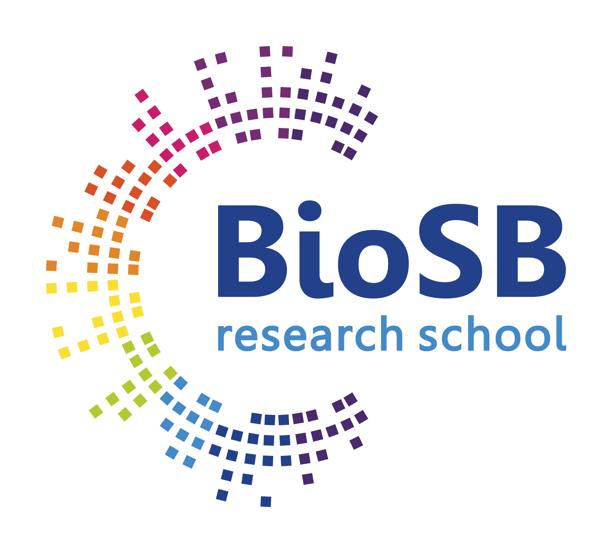

# Machine Learning for Bioinformatics & Systems Biology

  * [Target audience](#target-audience)
  * [Learning objectives](#learning-objectives)
  * [Description](#description)
  * [Registration](#registration)
  * [Course material](#course-material)
  * [Assignment](#assignment)
  * [Location and travel information](#location-and-travel-information)
  * [Schedule](#schedule)
  * [Pointers](#pointers)
  
A yearly course, part of the [BioSB](https://www.dtls.nl/biosb/) Research School

*Course coordinator*:
   * dr. ir. Perry Moerland
   * e-mail: p.d.moerland@amsterdamumc.nl	

*Lecturers*
   * dr. ir. Perry Moerland (Amsterdam UMC, location: Academic Medical Center)   
   * prof. dr. ir. Marcel Reinders (Delft University of Technology)
   * prof. dr. Lodewyk Wessels (Netherlands Cancer Institute)
     
For more information about the course programme, please contact [Perry Moerland](mailto:p.d.moerland@amsterdamumc.nl); for more information about registration or logistics, please contact [Petra Aarnoutse](mailto:petra.aarnoutse@health-ri.nl).

## Target audience

The course is aimed at PhD students with a background in bioinformatics, systems biology, computer science or a related field, and life sciences. Participants from the private sector are also welcome. A working knowledge of basic statistics and linear algebra is assumed. Preparation material on statistics and linear algebra will be distributed before the course, to be studied by students missing the required background.

## Learning objectives

After having followed this course, the student has a good understanding of a wide range of machine learning techniques and is able to recognize what method is most applicable to data analysis problems (s)he encounters in bioinformatics and systems biology applications.

## Description

Modern biology is a data-rich science, driven by our ability to measure the detailed molecular characteristics of cells, organs, and individuals at many different levels. Interpretation of these large-scale biological data requires the detection of statistical dependencies and patterns in order to establish useful models of complex biological systems. Techniques from machine learning are key in this endeavour. Examples are the visualization of single-cell RNA-seq data using dimensionality reduction methods, base calling for nanopore sequencing data using (recurrent) neural networks, and classification of high-throughput microscopy image data using convolutional neural networks. 

In this one-week course, the foundations of machine learning will be laid out and commonly used methods for unsupervised (clustering, dimensionality reduction, visualization) and supervised (mainly classification) learning will be explained in detail. Methods will be illustrated using recent examples from the fields of systems biology and bioinformatics. Methods discussed in the lectures will be put into practice during the computer lab sessions. The course can optionally be extended with an assignment in which you write a 5-10 page report describing the analysis of a biological dataset using some of the methods taught in the course.

## Registration

You can register for this course by filling out the BioSB [registration form](https://www.dtls.nl/courses/machine-learning-for-bioinformatics-and-system-biology-fundamental-2025/). The maximum number of participants is 25, so register soon to be sure of a course seat!

The course fee includes all course material. Lecture slides, a computer lab manual and software required for the computer labs (MATLAB toolboxes) will be made available online.

   * Catering: Coffee, tea, soft drinks and lunch will be provided.

 <!--- Information about hostel accommodation in Amsterdam can be found [[https://vu.nl/en/education/more-about/summer-school-accommodation][here]] (Additional nights). Accommodation is not included in the course fee.--->

## Course material

All course materials including the handouts of the slides, a computer lab manual and the required data and Matlab toolboxes will be made available before the start of the course. 

Have a look at the following documents before the start of the course:
   * A [self-evaluation test](background/Self-evaluation.pdf) on the prerequisite prior knowledge (mainly probability theory, some linear algebra). If you have a lot of trouble answering some of these exercises, consult the text books mentioned in the PDF, or a few [primers](background/Primers.zip) on these topics.
   * The computer labs make extensive use of Matlab. You do not need to be a fluent programmer, but if you have never worked with Matlab before it may help to have a look at the Appendices of the computer lab [manual](manual/Manual.pdf). An extensive Matlab [primer](background/Matlab.pdf) is also available. 

<!---During the course Matlab and all other software/data have to be installed on your laptop.--->

   * Material used during the lectures:
      * Handouts of the slides used during the course (link will be added before the start of the course);

   * Material used during the computer labs:
      * Computer lab [manual](manual/Manual.pdf) (PDF; work in progress, so will still change);
      * [Matlab toolboxes and datasets](website/Data_and_code.zip) (ZIP) used, among which PRTools is the most important toolbox.

To use the code and data, download the ZIP file, unpack everything in the same directory and run _prstartup_ from the Matlab command prompt. If you do not have access to a Matlab campus license, install the 30-day free [trial](https://nl.mathworks.com/campaigns/products/trials.html). When indicating toolboxes to install, you should at least select the _Deep Learning_, _Optimization_ and _Statistics and Machine Learning_ toolboxes.
    
## Assignment

Participants requiring a certificate of successful completion (3 ECTS) should make a final assignment. You will analyse a biological dataset (preferably one from your own practice) using some of methods taught in the course, and write a small report (5-10 pages) on the results. If you have no dataset available, one will be provided. The report will have to be mailed to [Perry Moerland](mailto:p.d.moerland@amsterdamumc.nl) no later than three weeks after the course has finished (February 14, 2025). We will strictly adhere to this deadline; if you require extension, you should contact us well in advance. The proposal will be graded "fail" or "pass", with one possible resubmission. Those who choose not to make the final assignment will receive a certificate of participation (1.5 ECTS). 

## Location and travel information

Course classrooms are located in the Amsterdam UMC, location [Academic Medical Center](https://www.google.nl/maps/@52.294629,4.9557843,1121m/data=!3m1!1e3) (AMC; in Dutch: Academisch Medisch Centrum), Meibergdreef 9, Amsterdam.
 
Detailed travel information to the AMC can be found at https://www.amsterdamumc.nl/en/location-amc/address.htm. The metro/train station is at about 10 minutes walking distance from the class rooms and can be reached in less than 30 minutes from Amsterdam Central Station and Schiphol Airport.
 
## Schedule

The course will run in the week of *January 20-24 2025*. 

<!---Preparation material on statistics and linear algebra will be distributed before the course, to be studied by students missing the required background. After the course, 2-3 days will have to be spent on the report to be handed in by those wanting to do the final assignment.--->
Course days will generally have the following schedule:

   * 9.00 - 12.00: 	Lecture
   * 12.00 - 13.00: 	Lunch break 
   * 13.00 - 17.00: 	Computer lab

On Friday January 24 there will be session in which each of you has to give a short presentation (5-10 minutes) on a machine learning problem you would like to solve using methods taught in the course, preferably using your own data.

*Note that we are still updating the course material. Links to the slides will be added later.*

*Monday* (January 20; L0-227, AMC) -	*Introduction, density estimation and classifiers*  
*Lecturer* 	Perry Moerland  
*Subjects* 	Introduction to machine learning. Density estimation: histograms, nearest neighbour, Parzen. Bayesian classification.  Parametric classifiers: (D)LDA, (D)QDA. Nonparametric classifiers: k-NN, Parzen. Discriminant analysis: logistic regression.

*Tuesday* (January 21; L0-227, AMC) - *Classifiers (continued) and clustering*   
*Lecturer* 	Perry Moerland  
*Subjects* 	Decision trees and random forests. Hierarchical clustering. Agglomerative clustering. Model-based clustering: mixtures-of-Gaussians, Expectation-Maximization.

*Wednesday* (January 22; L0-227, AMC) - *Feature selection and extraction*  
*Lecturer* 	Lodewyk Wessels  
*Subjects* 	Feature selection: criteria, search algorithms (forward, backward, branch & bound). Feature extraction: PCA, Fisher. Embeddings: MDS t-SNE. Sparse classifiers: Ridge, LASSO. 

*Thursday* (January 23; L0-227, AMC) - *Neural networks and support vector machines*  
*Lecturer* 	Marcel Reinders  
*Subjects*  Artificial neural networks. Support vector machines. Classifier ensembles. Complexity and regularisation.
*At 5pm there will be drinks, bites and a quiz at [Miss Scarlett](https://miss-scarlett.nl/en/homepage/) (nice café at 5 minutes walking from the AMC) * (in collaboration with [YoungCB](https://www.dtls.nl/youngcb/))

*Friday*  (January 24;  L0-229, AMC) - *Variational autoencoders and diffusion models* and *student pitches*  
*Lecturer* 	Marcel Reinders  
*Subjects* 	Deep learning: variational autoencoders, diffusion models.  

## Pointers
Additional tools (not required for the course, but perhaps interesting):
   * [scikit-learn](https://scikit-learn.org/stable/) is a free software machine learning library for the Python programming language
   * R is very popular for solving data analysis problems. [Here](https://cran.r-project.org/doc/contrib/Hiebeler-matlabR.pdf) is a short reference that provides a mapping between Matlab and R commands.
   * R packages relevant for some of the topics treated in the course are (spread out over a whole range of packages, list is far from complete):
      * First have a look at [mlr3](https://mlr3.mlr-org.com/) which is _the_ machine learning package in R.
      * Then have a look at [caret](https://topepo.github.io/caret/index.html)  which also provides a nice set of functions that attempt to streamline the process for creating predictive models. 
      * [e0171](https://cran.r-project.org/web/packages/e1071/index.html): support vector machines and a flexible framework for cross-validation/bootstrapping using the _tune_ function
      * [MASS](https://cran.r-project.org/web/packages/MASS/index.html): dla, qda
      * [rpart](https://cran.r-project.org/web/packages/rpart/index.html): decision trees
      * [stats](https://stat.ethz.ch/R-manual/R-patched/library/stats/html/00Index.html) (installed by default): hierarchical clustering, kmeans
      * [glmnet](https://cran.r-project.org/web/packages/glmnet/index.html): lasso, elastic net
      * See [CRAN Task View: Machine Learning & Statistical Learning](https://cran.r-project.org/web/views/MachineLearning.html) and [CRAN Task View: Cluster Analysis & Finite Mixture Models](https://cran.r-project.org/web/views/Cluster.html) for pointers to other packages
   * [WEKA](https://www.cs.waikato.ac.nz/ml/weka/), a Java-based collection of machine learning algorithms for data mining
   * [Shogun](https://www.shogun-toolbox.org/), a machine learning library particularly suitable for large scale kernel methods

Some good material for further reading:
   * G. James, D. Witten, T. Hastie and R. Tibshirani, [An Introduction to Statistical Learning](https://www.statlearning.com/), also freely available on-line with R code and Jupyter notebooks,  slides, videos etc.
   * K.P. Murphy, [Probabilistic Machine Learning: An Introduction](https://probml.github.io/pml-book/book1.html), also freely available on-line with Python code.
   * R.O. Duda, P.E. Hart and D.G. Stork, [Pattern classification](https://www.amazon.com/Pattern-Classification-2nd-Richard-Duda/dp/0471056693/ref=pd_bbs_sr_1?ie=UTF8&s=books&qid=1232058027&sr=8-1), 2nd ed., 2000. ISBN: 0471056693.
   * C. Bishop, [Pattern recognition and machine learning](https://www.amazon.com/Pattern-Recognition-Learning-Information-Statistics/dp/0387310738/ref=pd_bxgy_b_img_b), 2007. ISBN: 0387310738.
   * T. Hastie, R. Tibshirani and J. Friedman, [The elements of statistical learning: data mining, inference, and prediction](https://web.stanford.edu/~hastie/ElemStatLearn/), 2nd ed., 2009. ISBN: 0387848576.
   * D. Barber, [Bayesian Reasoning and Machine Learning](http://web4.cs.ucl.ac.uk/staff/D.Barber/pmwiki/pmwiki.php?n=Brml.HomePage), also freely available on-line.
   * A. Webb, [Statistical pattern recognition](https://www.amazon.com/Statistical-Pattern-Recognition-Andrew-Webb/dp/0470845147/ref=sr_1_1?ie=UTF8&s=books&qid=1232058254&sr=1-1), 2nd ed., 2002. ISBN: 0470845147.
   * F. van der Heijden, R.P.W. Duin, D. de Ridder and D.M.J. Tax, [Classification, parameter estimation and state estimation: an engineering approach using MATLAB](https://www.amazon.com/Classification-Parameter-Estimation-State-Engineering/dp/0470090138/ref=sr_1_1?ie=UTF8&s=books&qid=1232058361&sr=1-1), 2004. ISBN: 0470090138.
   * A.K. Jain, R.P.W. Duin and J. Mao, [Statistical pattern recognition: a review](https://citeseerx.ist.psu.edu/viewdoc/summary?doi=10.1.1.123.8151), IEEE Tr. on Pattern Analysis and Machine Intelligence 22(1):4-37, 2000. 
   * M. Fernández-Delgado, E. Cernadas, S. Barro, Dinani Amorim, [Do we Need Hundreds of Classifiers to Solve Real World Classification Problems?](https://jmlr.org/papers/v15/delgado14a.html), JMLR, 15(Oct):3133-3181, 2014.
